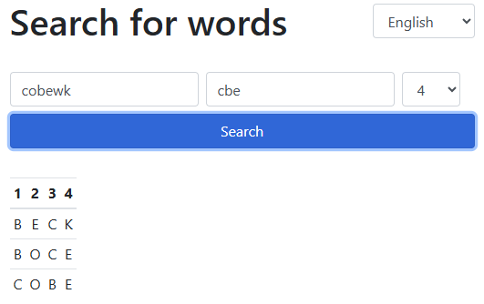

# WordsOfWondersHelp


## About the Project

**WordsOfWondersHelp** is a simple web-based helper tool for the popular word game **Words of Wonders**. If you're stuck on a level and need help finding a word, this tool makes it easy to search for possible words.

🔗 **Live Version:** [WordsOfWondersHelp](https://mprtenjak.github.io/WordsOfWondersHelp/)

## Features

- Quickly find words you need for the game
- Supports multiple languages
- Easy-to-extend system for adding new languages



## Supported Languages

Currently, the following languages are available:

- **English**
- **Slovenščina**

## Adding a New Language

To contribute and add a new language, follow these steps:

1. **Download the project** by cloning the repository:
   ```bash
   git clone https://github.com/mprtenjak/WordsOfWondersHelp.git
   cd WordsOfWondersHelp
   ```
2. **Create a new folder** under the `/data` directory named after your language (e.g., `Spanish`).
3. **Copy and translate the JSON file:**
   - Copy `/data/English/translations.json` into your new language folder.
   - Translate all the words in this JSON file.
4. **Obtain a list of words** in your language and save it as a `.txt` file.
5. **Place the word list** inside your language folder under `/data/<YourLanguage>/src`.
6. **Process the words:**
   - Open a terminal and navigate to the `/data` folder.
   - Run the following command (replace `<YourLanguage>` and `words.txt` accordingly):
     ```bash
     node processWords.js <YourLanguage> words.txt
     ```
   - This will generate word files based on word length.
7. **Update the list of available languages:**
   - Run form `/data` subfolder:
     ```bash
     node processLanguages.js
     ```
   - This will add your new language to `languages.json`.
8. **Commit and push your changes:**
   ```bash
   git add .
   git commit -m "Added support for <YourLanguage>"
   git push
   ```

## Contributing

Contributions are welcome! Feel free to submit a pull request if you want to improve the project or add more languages.

## License

There is absolutely no license.

## Contact

For any questions or issues, feel free to reach out via the GitHub issues section.

---

Happy gaming! 🎮
